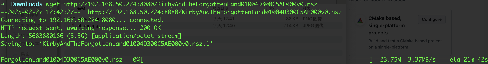
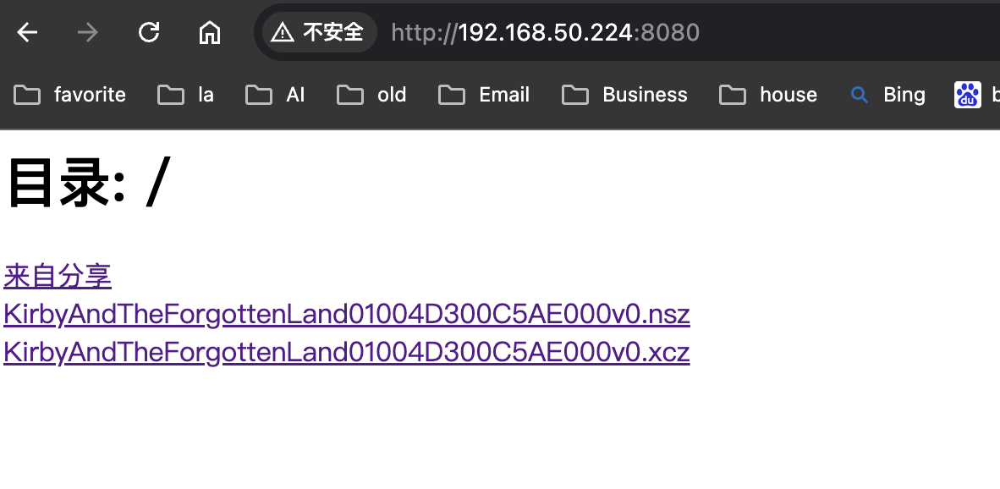
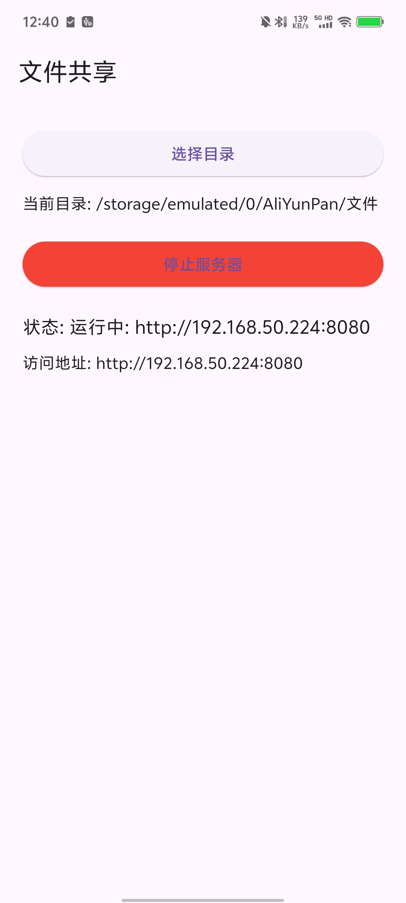

# freeshare

**Share Files by HTTP**

Freeshare is an Android app built with Flutter that allows you to share files over HTTP. It sets up an HTTP server on your Android device, enabling easy file transfers between devices in your local network.

## Features
- Start an HTTP server to serve files from your Android device.
- Share files easily with others over the local network.
- Simple and intuitive user interface.

## Screenshots

### Screenshot


### Browser Screenshot


### Phone Screenshot


## Getting Started

To get started with Freeshare, clone the repository and open the project in your preferred IDE (e.g., Android Studio or VS Code).

### Prerequisites
- Flutter SDK installed on your machine. If you haven't installed Flutter yet, follow the official documentation to set it up:
    - [Flutter installation guide](https://docs.flutter.dev/get-started/install)
- An Android device or emulator for testing.

### Installation

1. Clone the repository:
   ```bash
   git clone https://github.com/yourusername/freeshare.git
   cd freeshare
   ```
Install dependencies:
```
flutter pub get
```

Run the app on your Android device or emulator:
```
flutter run
```

## Usage
Open the app on your Android device.
The app will automatically start an HTTP server on the local network.
Use a browser or file manager on another device to access the shared files by entering the provided server URL.

## License
This project is licensed under the MIT License - see the LICENSE file for details.